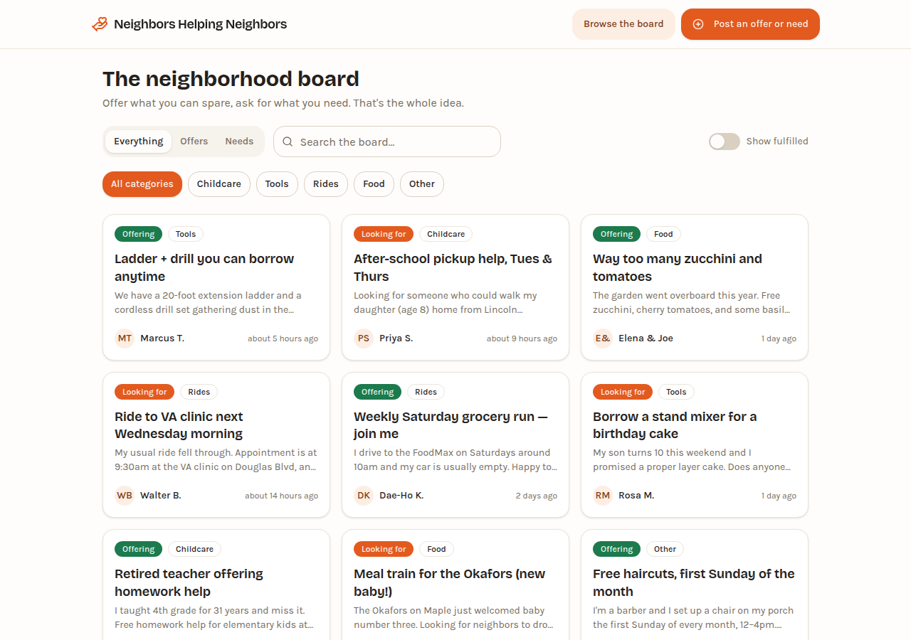
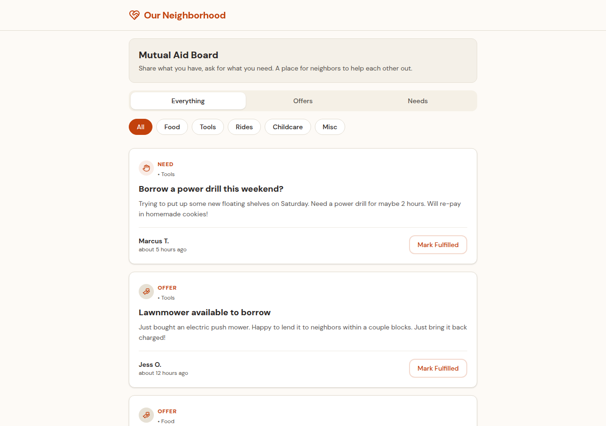
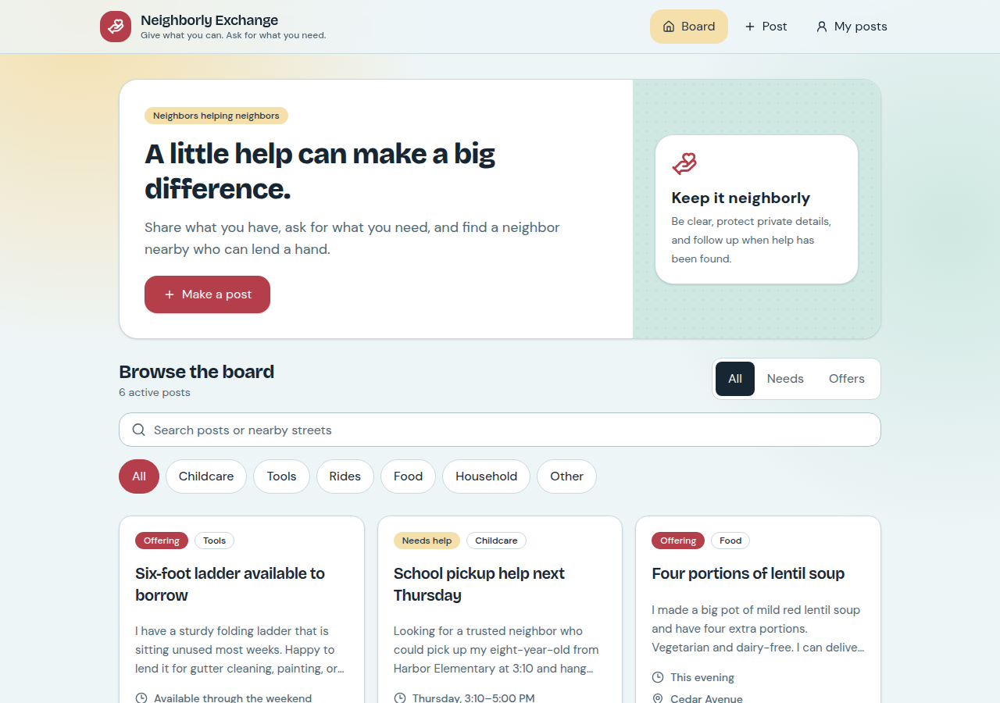

# Model bench — 2026-07-16T23-59-c66f6dd

- **Task:** mutual-aid-board (task v1, harness 1.0.0, commit `c66f6dd`)
- **Date:** 2026-07-17T00:05:49.115Z
- **Trials per model:** 1
- **Human review:** _not scored yet — open review/index.html, score, export, save as review/scores.json, re-run report_

> Cost and token figures are **estimates** (chars ÷ 4 × list prices) — directional, not billing-grade.
> Mechanical columns are medians across trials; latency = full generation wall time.

| Model | Bundle | Files | Failed edits | Truncated | Checks | Sec flags | TTFT | Latency | ~$ | Design | RTP fit | Complete | Rank | |
|---|---|---|---|---|---|---|---|---|---|---|---|---|---|---|
| fable-5 | 1/1 ✓| 11 | 0 | no | 5/5 | 0 | 38s | 145s | 0.47 | — | — | — | — |
| opus-4.8 | 1/1 ✓| 11 | 0 | no | 5/5 | 0 | 1s | 108s | 0.21 | — | — | — | — |
| gemini-3.1-pro | 1/1 ✓| 8 | 0 | no | 4/5 | 0 | 13s | 55s | 0.08 | — | — | — | — |
| gpt-5.6-sol | 1/1 ✓| 12 | 0 | no | 5/5 | 0 | 12s | 97s | 0.34 | — | — | — | — |
| kimi-k3 | ✗ all errored| — | — | no | —/0 | — | — | — | — | — | — | — | — | 1 errored

## Which model for what

_Maintainer's call, informed by the table above — the report feeds the decision, it doesn't make it._

- **Community first-build default:** _fill in_
- **Community edit model:** _n/a for this task version (build-only) — add an edit task before deciding here_
- **Free/open-tier candidate:** _fill in_

## Errors

- **kimi-k3** t1: OpenRouter API error (429): {"error":{"message":"Provider returned error","code":429,"metadata":{"raw":"moonshotai/kimi-k3 is temporarily rate-limited upstream. Please retry shortly, or add your own key to accumulate your rate limits: https://openrouter.ai/settings/integrations","provider_name":"Moonshot AI","is_byok":false,"retry_after_seconds":1,"retry_after_seconds_raw":1,"headers":{"Retry-After":"1"}}},"user_id":"user_3Gbh2zmbkUZRqGfiXTo62nfbcec"}

## Previews

### fable-5 (trial 1)

### opus-4.8 (trial 1)

### gemini-3.1-pro (trial 1)

### gpt-5.6-sol (trial 1)

