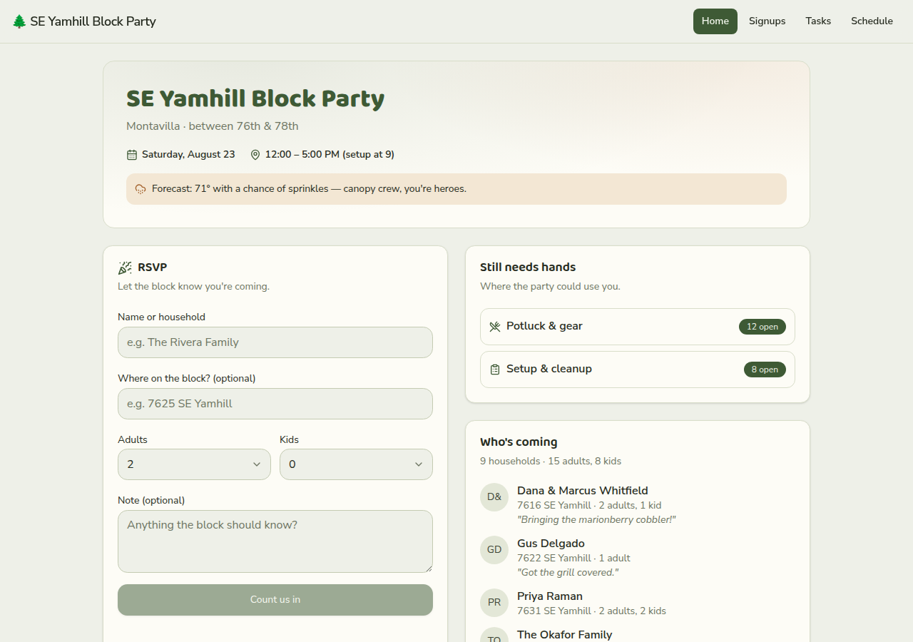
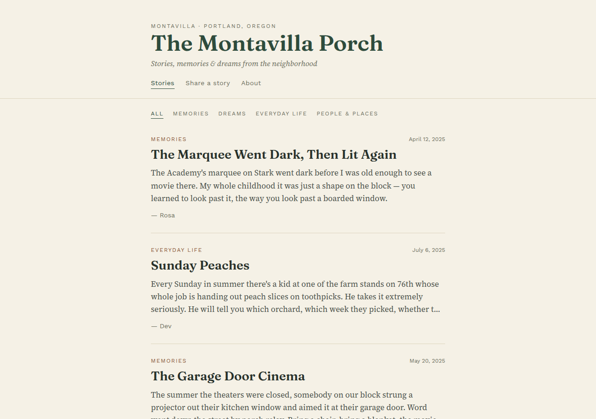
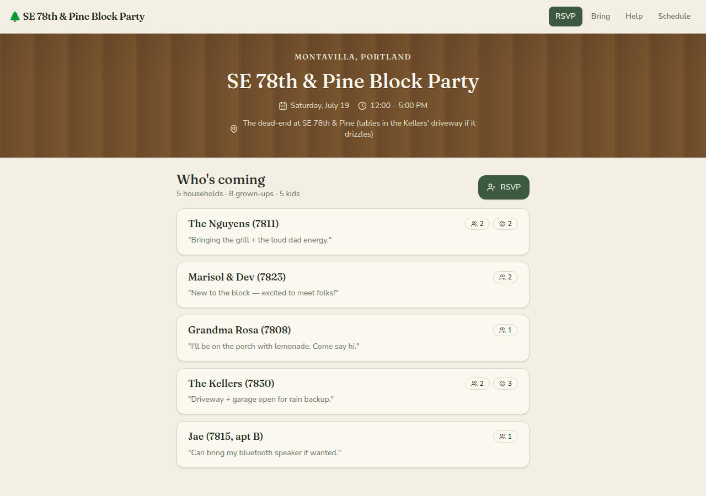
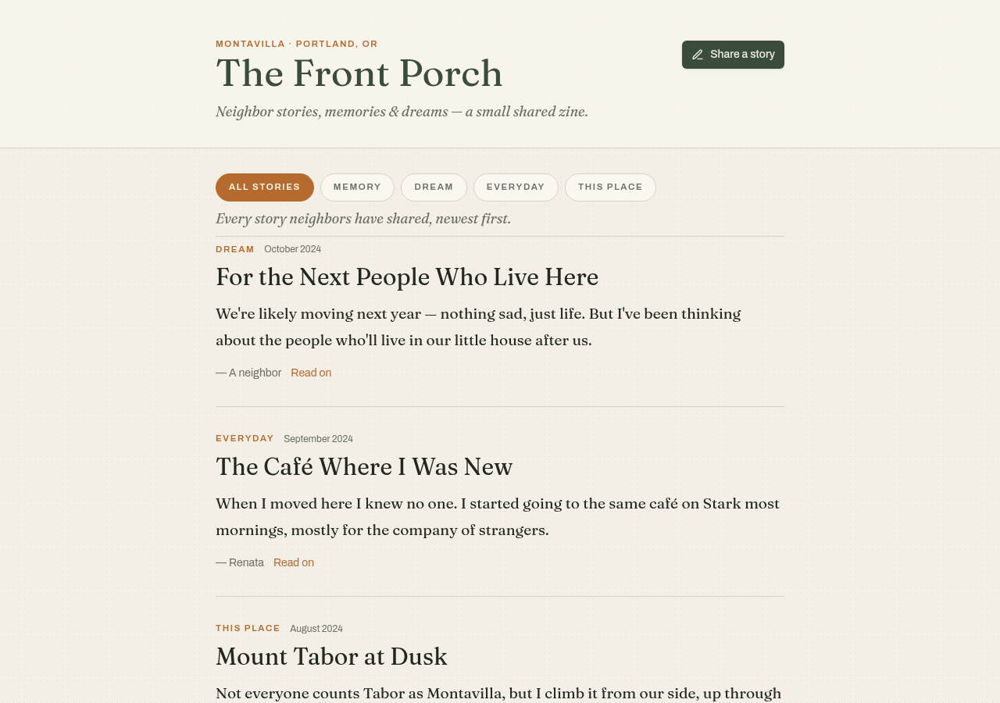

# Model bench — 2026-07-17T17-08-cf213f0

- **Tasks:** pdx-block-party, pdx-story-porch (harness 1.0.0, commit `cf213f0`)
- **Date:** 2026-07-17T17:21:06.952Z
- **Trials per model per task:** 1 · **plan-first flow** (plan-mode reply precedes each build, same model)
- **Human review:** _pending_

> Cost and token figures are **estimates** (chars ÷ 4 × list prices) — directional, not billing-grade.
> Mechanical columns are medians across trials. Total = plan + build wall time.

### Task: pdx-block-party (exp-v1)

| Model | Bundle | Files | Failed edits | Truncated | Checks | Sec flags | TTFT | Plan time | Build time | Total | ~$ | |
|---|---|---|---|---|---|---|---|---|---|---|---|---|
| fable-5 | 1/1 ✓ | 11 | 0 | no | 5/5 | 0 | 93s | 39s | 204s | 243s | 0.60 |
| opus-4.8 | 1/1 ✓ | 11 | 0 | no | 5/5 | 0 | 2s | 30s | 124s | 154s | 0.27 |

### Task: pdx-story-porch (exp-v1)

| Model | Bundle | Files | Failed edits | Truncated | Checks | Sec flags | TTFT | Plan time | Build time | Total | ~$ | |
|---|---|---|---|---|---|---|---|---|---|---|---|---|
| fable-5 | 1/1 ✓ | 10 | 0 | no | 4/5 | 0 | 92s | 31s | 191s | 222s | 0.51 |
| opus-4.8 | 1/1 ✓ | 11 | 0 | no | 4/5 | 0 | 2s | 34s | 125s | 159s | 0.27 |

## Human review

_Not scored yet — open review/index.html, score, export, save as review/scores.json, re-run report._

## Which model for what

_Maintainer's call, informed by the tables above — the report feeds the decision, it doesn't make it._

## Previews

### pdx-block-party — fable-5 (trial 1)

### pdx-story-porch — fable-5 (trial 1)

### pdx-block-party — opus-4.8 (trial 1)

### pdx-story-porch — opus-4.8 (trial 1)

