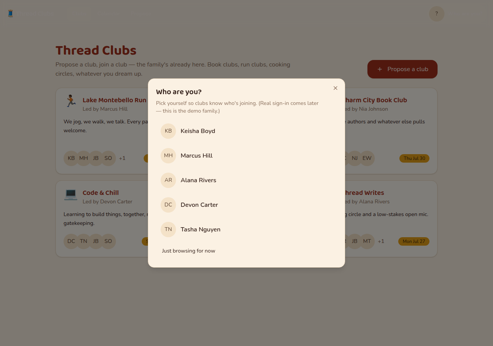
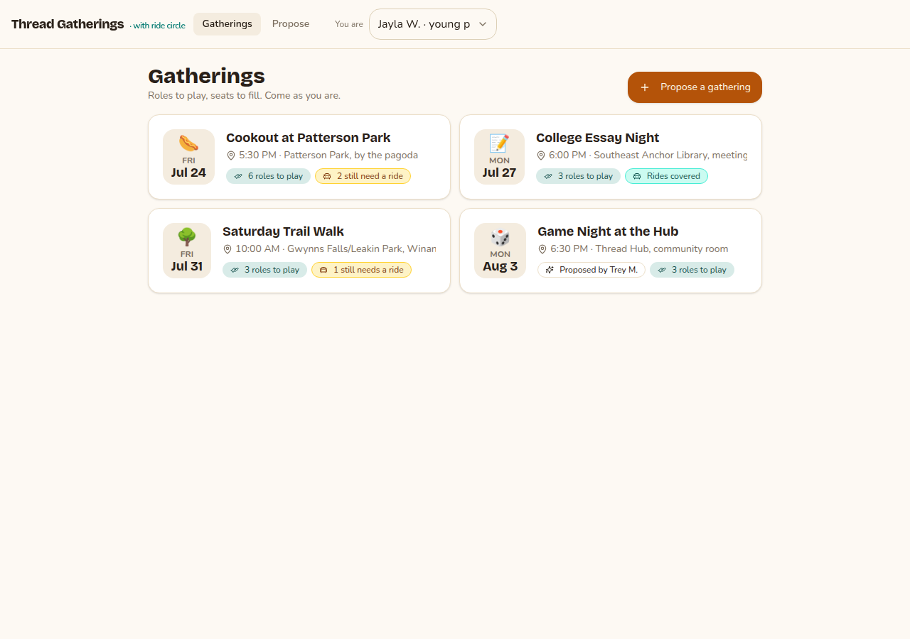

# Model bench — 2026-07-22T03-28-ef0027d

- **Tasks:** thread-clubs, thread-gatherings-remix (harness 1.0.0, commit `ef0027d`)
- **Date:** 2026-07-22T03:37:18.443Z
- **Trials per model per task:** 1 · **plan-first flow** (plan-mode reply precedes each build, same model)
- **Studio frame:** `thread` — built with the studio's frame + private library in context, as an approved member sees it
- **Human review:** _pending_

> Cost and token figures are **estimates** (chars ÷ 4 × list prices) — directional, not billing-grade.
> Mechanical columns are medians across trials. Total = plan + build wall time.
> **Bundle** = final compile success; **First try** = compiled without the auto-fix; **Fix** = of the builds that first failed, how many the single auto-fix pass solved. **~$** includes the fix pass when one ran.

### Task: thread-clubs (exp-v1)

| Model | Bundle | First try | Fix | Files | Failed edits | Truncated | Checks | Sec flags | TTFT | Plan time | Build time | Total | ~$ | |
|---|---|---|---|---|---|---|---|---|---|---|---|---|---|---|
| fable-5 | 1/1 ✓ | 1/1 | — | 14 | 0 | no | 4/5 | 0 | 86s | 37s | 223s | 260s | 0.71 |

### Task: thread-gatherings-remix (exp-v1)

| Model | Bundle | First try | Fix | Files | Failed edits | Truncated | Checks | Sec flags | TTFT | Plan time | Build time | Total | ~$ | |
|---|---|---|---|---|---|---|---|---|---|---|---|---|---|---|
| fable-5 | 1/1 ✓ | 1/1 | — | 12 | 0 | no | 4/5 | 0 | 85s | 44s | 239s | 283s | 0.82 |

## Human review

_Not scored yet — open review/index.html, score, export, save as review/scores.json, re-run report._

## Workshop read (Thread × RTP dry-run)

Two builds a Thread member invited by Jordan would produce tomorrow, on the free
community default (Fable 5, plan-first) with Thread's frame + private library in
context:

- **Both compiled and bundled first try** — 0 failed edits, 0 continuations, 0
  security flags, no auto-fix pass needed. A member would land on a working,
  deploy-ready preview without hitting an error.
- **Time:** ~4½ min end to end each (plan ~40s, build ~3½–4 min). A pair has a
  real app well inside the 30-minute build block.
- **Cost:** ~$0.71 (clubs) + ~$0.82 (remix) ≈ **$1.50 for both**, estimated at
  list prices. Five pairs each doing one build ≈ **$3–4 of community budget** for
  the whole room.
- **Studio frame landed:** the remix plan explicitly builds "on the Thread
  Gatherings recipe from the studio library," keeps its personas / roles-to-play
  / propose flow, and grounds the ride-circle twist in *Others Before Self*. The
  clubs build seeds a Baltimore-real "demo family" (Lake Montebello Run, Charm
  City Book Club, Code & Chill) in Thread's voice. Both read as Thread, not
  generic.
- **`seeded-data` shows 4/5 but is a false negative:** both apps ship rich seed
  data (`src/data/seed.ts` — `seedClubs`/`seedEvents`/`seedMembers`, visible in
  the screenshots). The frozen check's regex was written for the "posts" tasks
  and doesn't match the `seed<Domain>` naming here. Left the check unchanged
  (frozen-task rule) — the builds satisfy its intent.

The one rough edge was not the model: on the first run the OpenRouter Fable path
closed the clubs build stream with **zero tokens and no error**, which scored as
an empty build. Hardened the harness so a 0-char completion is a retryable
failure (`bench/lib/session.ts`); the re-run was clean. Worth knowing for the
workshop: if a build ever comes back blank, just send again — it's a provider
hiccup, not the prompt.

## Which model for what

_Maintainer's call, informed by the tables above — the report feeds the decision, it doesn't make it._

## Previews

### thread-clubs — fable-5 (trial 1)

### thread-gatherings-remix — fable-5 (trial 1)

