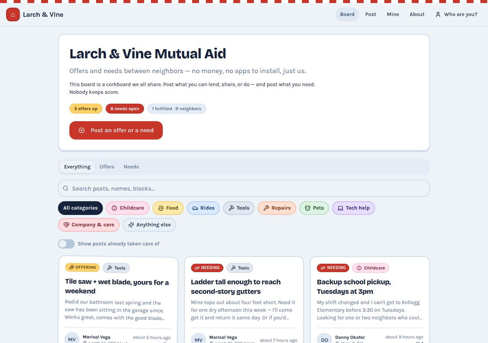
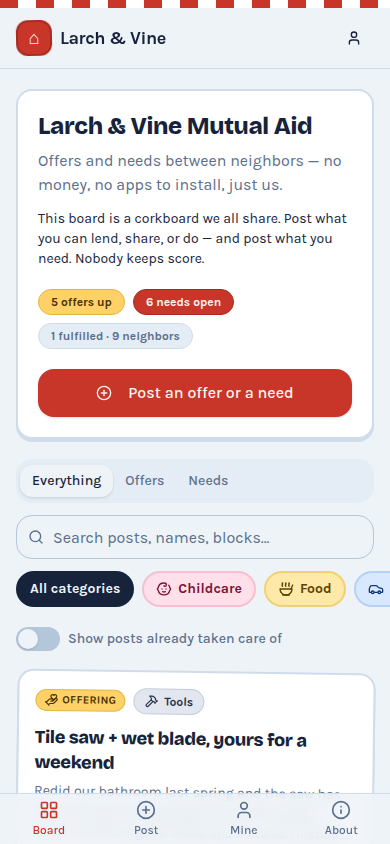
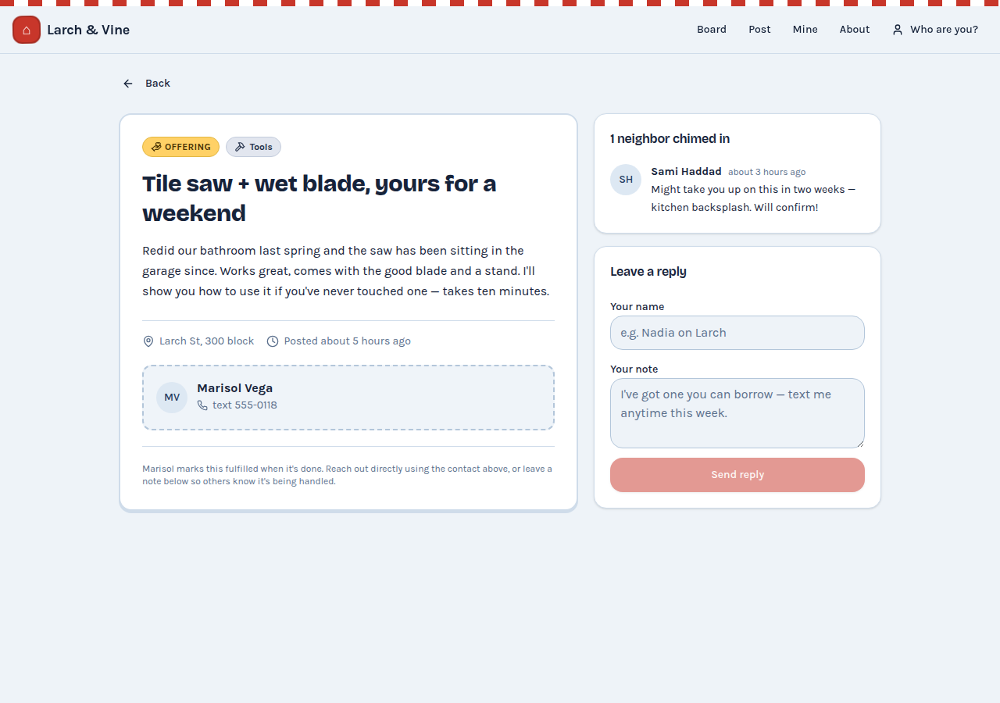

# Model bench — 2026-07-27T17-23-28db9a8

- **Tasks:** mutual-aid-board (harness 1.0.0, commit `28db9a8`)
- **Date:** 2026-07-27T17:28:55.452Z
- **Trials per model per task:** 2
- **Human review:** _pending_

> Cost and token figures are **estimates** (chars ÷ 4 × list prices) — directional, not billing-grade.
> Mechanical columns are medians across trials. Total = plan + build wall time.
> **Bundle** = final compile success; **First try** = compiled without the auto-fix; **Fix** = of the builds that first failed, how many the single auto-fix pass solved. **~$** includes the fix pass when one ran.

### Task: mutual-aid-board (v1)

| Model | Bundle | First try | Fix | Files | Failed edits | Truncated | Checks | Sec flags | TTFT | Build time | Total | ~$ | |
|---|---|---|---|---|---|---|---|---|---|---|---|---|---|
| opus-5 | 1/1 ✓ | 1/1 | — | 17 | 0 | no | 5/5 | 0 | 87s | 326s | 326s | 0.51 | 1 errored

## Human review

_Not scored yet — open review/index.html, score, export, save as review/scores.json, re-run report._

## Which model for what

_Maintainer's call, informed by the tables above — the report feeds the decision, it doesn't make it._

### Run notes (Opus 5 launch check)

- **One live trial, not three.** OpenRouter credit ran out mid-run (t2's 402 below);
  actual billed cost for t1 was **$0.56**. Same single-trial rigor as the July 16
  decision run this compares against — treat directionally, confirm with `--trials 3`
  before any further routing change.
- **Screenshot recaptured.** The in-run shot came from the plain-chromium fallback,
  which the sandbox proxy blanks (CDN fetches reset). Recaptured with Playwright +
  Node-fetch-fulfilled routes: app renders cleanly, 51KB of DOM, zero console
  errors. Phone-viewport and post-detail shots added alongside.
- **Requests were capped at 20k output tokens** (`BENCH_MAX_TOKENS`, to clear
  OpenRouter's credit pre-authorization). No truncation — the cap did not bind.

### Against the July 16 baselines (same frozen task v1, same OpenRouter path)

| | opus-5 (this run) | fable-5 (Jul 16) | opus-4.8 (Jul 16) |
|---|---|---|---|
| Bundle | ✓ first try | ✓ | ✓ |
| Files | **17** | 11 | 11 |
| Checks | 5/5 | 5/5 | 5/5 |
| Build time | 326s | 145s | 108s |
| ~$ / trial | 0.51 est (0.56 actual) | 0.47 | 0.21 |
| Josh's design / complete | _pending_ | 7 / 7 (#1) | 5 / 6 (#3) |

What the extra 6 files buy (visible in the shots): a post **detail page with a
seeded reply thread**, contact cards, per-post fulfillment notes; a **Mine** page;
an **About** page; a name-picker sign-in; an editable-copy `content.ts`. Neither
July build shipped a detail view at all. Design direction is a red corkboard-flyer
identity (stitched tear-off header, per-category color chips) — distinct from
Fable's warm-cream default, which the current system prompt explicitly flags as
the known-trap look.

**Recommendation:** Opus 5 in as the **edit model** (same $5/$25 as Opus 4.8, and
this showing is far ahead of 4.8's July 5/6). For the **first-build** slot it
plausibly replaces Fable 5 at half the cost — completeness is clearly ahead;
design needs the maintainer's eyes on the shots. The one real cost is speed:
~5½ min vs Fable's ~2½ on this task.

## Errors

- **opus-5** · mutual-aid-board t2: OpenRouter API error (402): {"error":{"message":"This request requires more credits, or fewer max_tokens. You requested up to 20000 tokens, but can only afford 18269. To increase, visit https://openrouter.ai/settings/credits and add more credits","code":402,"metadata":{"provider_name":null,"previous_errors":[{"code":402,"message":"This request requires more credits, or fewer max_tokens. You requested up to 20000 tokens, but can only afford 18269. To increase, visit https://openrouter.ai/settings/credits and add more credits"},{"code":402,"message":"This request requires more credits, or fewer max_tokens. You requested up to 20000 tokens, but can only afford 18269. To increase, visit https://openrouter.ai/settings/credits and add more credits"},{"code":402,"message":"This request requires more credits, or fewer max_tokens. You requested up to 20000 tokens, but can only afford 18269. To increase, visit https://openrouter.ai/settings/credits and add more credits"},{"code":402,"message":"This request requires more credits, or fewer max_tokens. You requested up to 20000 tokens, but can only afford 18269. To increase, visit https://openrouter.ai/settings/credits and add more credits"},{"code":402,"message":"This request requires more credits, or fewer max_tokens. You requested up to 20000 tokens, but can only afford 18269. To increase, visit https://openrouter.ai/settings/credits and add more credits"}]}},"user_id":"user_3Gbh2zmbkUZRqGfiXTo62nfbcec"}

## Previews

### mutual-aid-board — opus-5 (trial 1)

Phone viewport and post detail (recaptured alongside the main shot):

