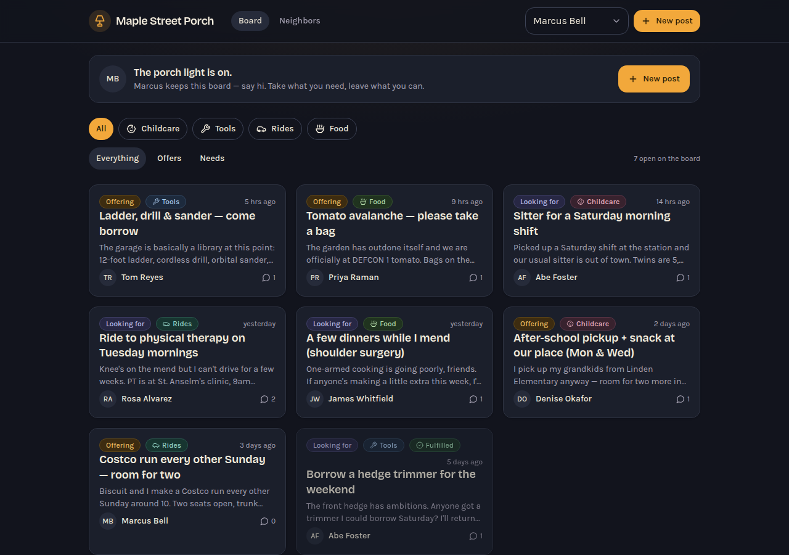

# Model bench — 2026-07-30T23-54-586cbbb

- **Tasks:** mutual-aid-board (harness 1.1.1, commit `586cbbb`)
- **Date:** 2026-07-31T00:25:07.653Z
- **Trials per model per task:** 2
- **Human review:** _pending_

> Cost and token figures are **estimates** (chars ÷ 4 × list prices) — directional, not billing-grade.
> Mechanical columns are medians across trials. Total = plan + build wall time.
> **Bundle** = final compile success; **First try** = compiled without the auto-fix; **Fix** = of the builds that first failed, how many the single auto-fix pass solved. **~$** includes the fix pass when one ran.

### Task: mutual-aid-board (v1)

| Model | Bundle | First try | Fix | Files | Failed edits | Truncated | Checks | Sec flags | TTFT | Build time | Total | ~$ | |
|---|---|---|---|---|---|---|---|---|---|---|---|---|---|
| kimi-k3-direct | 1/2 ✓ | 1/2 | 0/1 solved | 12 | 0 | no | 3.5/5 | 0 | 412s | 909s | 909s | 0.00 |

## Human review

_Not scored yet — open review/index.html, score, export, save as review/scores.json, re-run report._

## Which model for what

_Maintainer's call, informed by the tables above — the report feeds the decision, it doesn't make it._

## Fix passes (how solves went)

- **kimi-k3-direct** · mutual-aid-board t1: build failed to bundle → auto-fix not solved — still: vfs:/src/main.tsx:2: Could not find "@/App" in the project (imported from /src/main.tsx)
  - triggered by: `No entry module found (no index.html module script or /src/main.tsx)`

## Previews

### mutual-aid-board — kimi-k3-direct (trial 2)

### Run notes (Kimi K3 direct — first completed run)

- **First completed Kimi K3 signal, and it's split.** t2 is a clean success:
  bundle ✓ first try, 13 files across 3 planned chunks (NEXT-FILES protocol
  followed correctly), all 5 task checks pass, zero security findings, no fix
  round needed — and the app is genuinely warm (persona switcher, fulfilled
  states, seeded posts with real voice). t1 failed on extraction, not
  generation: Kimi glued its opening code fence to the end of a prose line,
  which inverted fence parity and silently dropped index.html, index.css,
  main.tsx, and App.tsx. The fix round recovered only two of the four.
- **The t1 failure was a real production bug, now fixed** (`24b7593`,
  harness 1.2.0): the extractor recognizes glued fence openers carrying a
  filename annotation. Replayed against t1's actual transcript, all 13 of its
  files extract — that build would almost certainly have bundled.
- **Speed is the real cost.** Thinking-only model at default max effort:
  TTFT 5–9 minutes, 14–16 minutes wall per build. Fine for a bench, painful
  for a live builder chat.
- **Moonshot capacity is rough:** four earlier run attempts (19:16–22:50 UTC)
  died entirely to 429 engine-overload windows lasting up to an hour, and two
  runs wedged on streams killed by session suspends (motivating the 1.1.1
  backoff and hard-deadline harness changes). `kimi-k3` is marked
  `owned_by: staff` on their models endpoint — possibly pre-GA capacity.
- Numbers here are harness 1.1.1 (t1 predates the 1.2.0 extractor fix);
  the follow-up 1.2.0 run is the comparable record for scoring.
