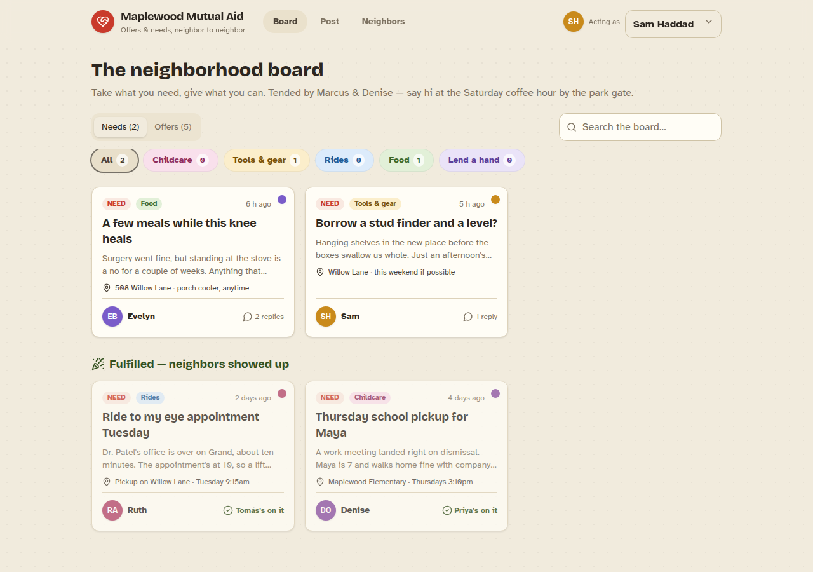
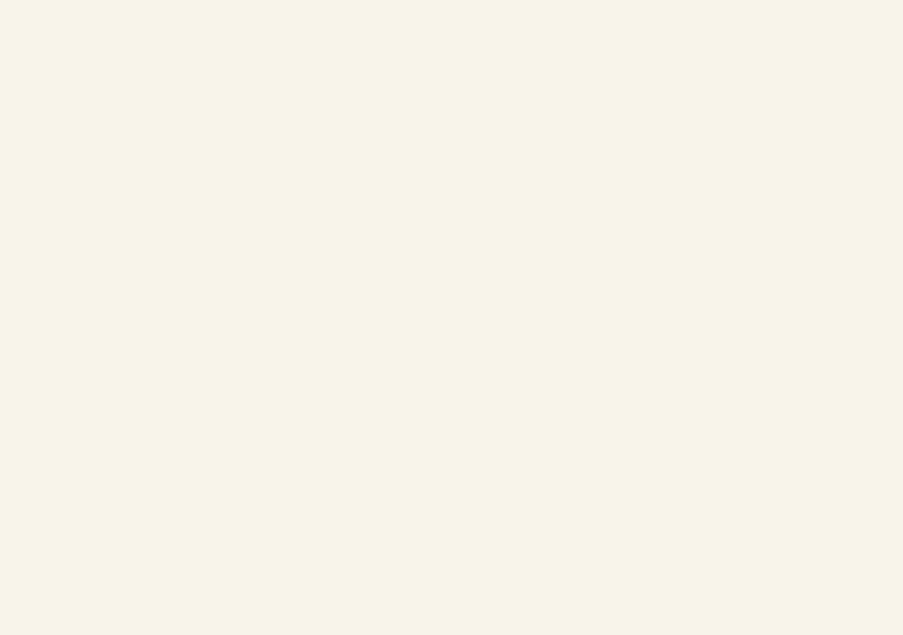

# Model bench — 2026-07-31T00-27-87f3b11

- **Tasks:** mutual-aid-board (harness 1.2.0, commit `87f3b11`)
- **Date:** 2026-07-31T01:01:38.272Z
- **Trials per model per task:** 2
- **Human review:** _pending_

> Cost and token figures are **estimates** (chars ÷ 4 × list prices) — directional, not billing-grade.
> Mechanical columns are medians across trials. Total = plan + build wall time.
> **Bundle** = final compile success; **First try** = compiled without the auto-fix; **Fix** = of the builds that first failed, how many the single auto-fix pass solved. **~$** includes the fix pass when one ran.

### Task: mutual-aid-board (v1)

| Model | Bundle | First try | Fix | Files | Failed edits | Truncated | Checks | Sec flags | TTFT | Build time | Total | ~$ | |
|---|---|---|---|---|---|---|---|---|---|---|---|---|---|
| kimi-k3-direct | 2/2 ✓ | 2/2 | — | 14 | 0 | no | 4.5/5 | 0 | 488s | 1031s | 1031s | 0.00 |

## Human review

_Not scored yet — open review/index.html, score, export, save as review/scores.json, re-run report._

## Which model for what

_Maintainer's call, informed by the tables above — the report feeds the decision, it doesn't make it._

## Previews

### mutual-aid-board — kimi-k3-direct (trial 1)

### mutual-aid-board — kimi-k3-direct (trial 2)

### Run notes (Kimi K3 direct — definitive harness-1.2.0 record)

- **2/2 bundles, both first try, no fix rounds.** 14 files per build, chunked
  cleanly over 3 segments each, zero failed edits, zero security findings.
  With the glued-fence extractor fix (1.2.0) and NEXT-FILES continuation
  (1.1.0), Kimi K3's output flows through the production pipeline losslessly.
- **t1's seeded-data check reads false-negative** — the screenshot plainly
  shows a fully seeded board (posts, replies, fulfilled claims), so this is
  the check's heuristic missing the seeding pattern, not an empty app.
- **t2 compiled but screenshotted blank** (background paints, no content) —
  likely a runtime exception on load; the bundle-ok column measures compile,
  not runtime. Worth a follow-up look at t2's preview.html before treating
  it as a full success.
- **Latency is the tradeoff:** TTFT ~8 min, ~17 min wall per build
  (thinking-only, default max effort; the API offers low/high/max efforts —
  untested here). Moonshot capacity was flaky all day (hour-long 429
  windows). Quality signal: strong. Live-builder viability: not yet.
