# Model bench — 2026-08-02T15-33-48aa455

- **Tasks:** edit-copy, edit-feature, edit-restyle (harness 1.2.0, commit `48aa455`)
- **Date:** 2026-08-02T15:37:50.121Z
- **Trials per model per task:** 3
- **Human review:** _pending_

> Cost and token figures are **estimates** (chars ÷ 4 × list prices) — directional, not billing-grade.
> Mechanical columns are medians across trials. Total = plan + build wall time.
> **Bundle** = final compile success; **First try** = compiled without the auto-fix; **Fix** = of the builds that first failed, how many the single auto-fix pass solved. **~$** includes the fix pass when one ran.

### Task: edit-copy (edit-seed-v1)

| Model | Bundle | First try | Fix | Files | Failed edits | Truncated | Checks | Sec flags | TTFT | Build time | Total | ~$ | |
|---|---|---|---|---|---|---|---|---|---|---|---|---|---|
| opus-5 | 3/3 ✓ | 3/3 | — | 0 | 0 | no | 3/3 | 0 | 7s | 7s | 7s | 0.07 |
| sonnet-5 | 3/3 ✓ | 3/3 | — | 0 | 0 | no | 3/3 | 0 | 4s | 5s | 5s | 0.04 |

### Task: edit-feature (edit-seed-v1)

| Model | Bundle | First try | Fix | Files | Failed edits | Truncated | Checks | Sec flags | TTFT | Build time | Total | ~$ | |
|---|---|---|---|---|---|---|---|---|---|---|---|---|---|
| opus-5 | 3/3 ✓ | 3/3 | — | 0 | 0 | no | 3/3 | 0 | 11s | 16s | 16s | 0.07 |
| sonnet-5 | 3/3 ✓ | 3/3 | — | 0 | 0 | no | 3/3 | 0 | 7s | 15s | 15s | 0.05 |

### Task: edit-restyle (edit-seed-v1)

| Model | Bundle | First try | Fix | Files | Failed edits | Truncated | Checks | Sec flags | TTFT | Build time | Total | ~$ | |
|---|---|---|---|---|---|---|---|---|---|---|---|---|---|
| opus-5 | 3/3 ✓ | 3/3 | — | 1 | 0 | no | 3/3 | 0 | 21s | 31s | 31s | 0.08 |
| sonnet-5 | 3/3 ✓ | 3/3 | — | 0 | 0 | no | 3/3 | 0 | 7s | 11s | 11s | 0.04 |

## Human review

_Not scored yet — open review/index.html, score, export, save as review/scores.json, re-run report._

## Which model for what

_Maintainer's call, informed by the tables above — the report feeds the decision, it doesn't make it._

## Previews

### edit-copy — opus-5 (trial 1)

### edit-copy — opus-5 (trial 2)

### edit-copy — opus-5 (trial 3)

### edit-feature — opus-5 (trial 1)

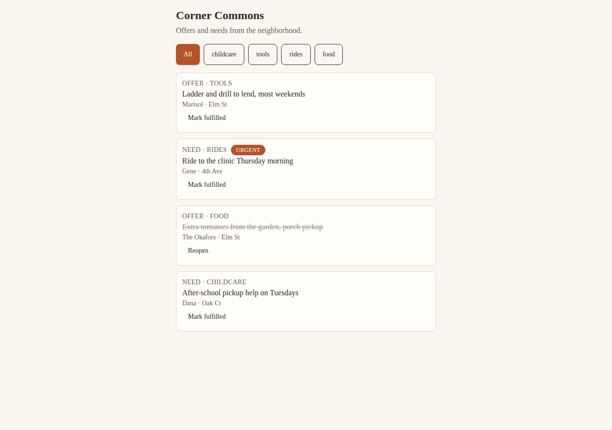

### edit-feature — opus-5 (trial 2)

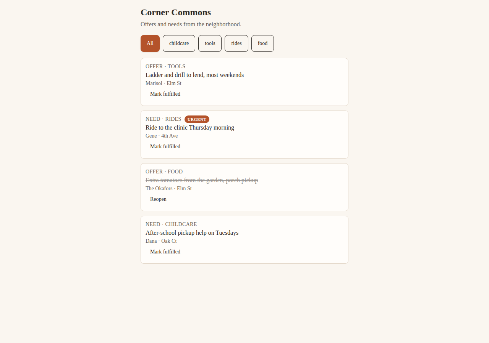

### edit-feature — opus-5 (trial 3)

### edit-restyle — opus-5 (trial 1)

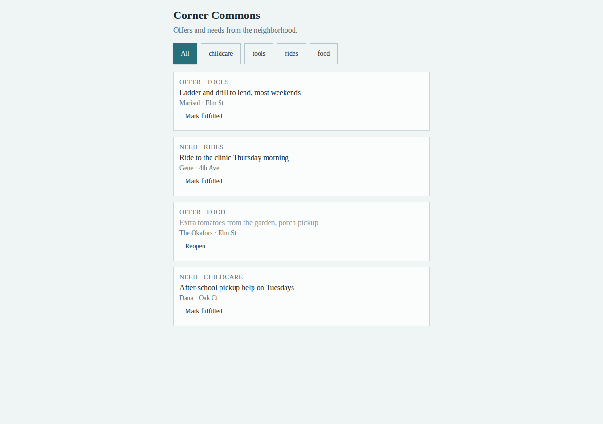

### edit-restyle — opus-5 (trial 2)

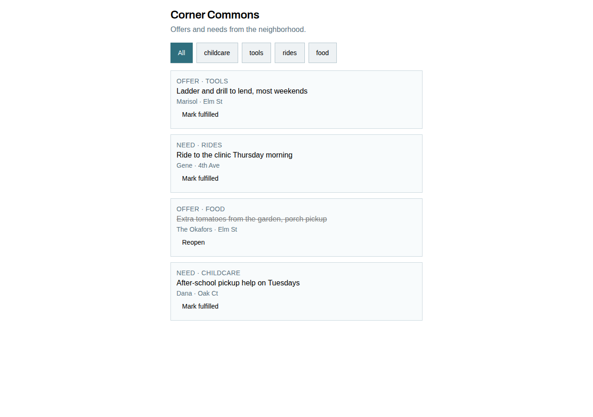

### edit-restyle — opus-5 (trial 3)

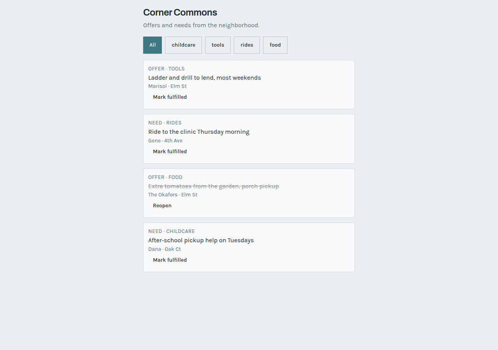

### edit-copy — sonnet-5 (trial 1)

### edit-copy — sonnet-5 (trial 2)

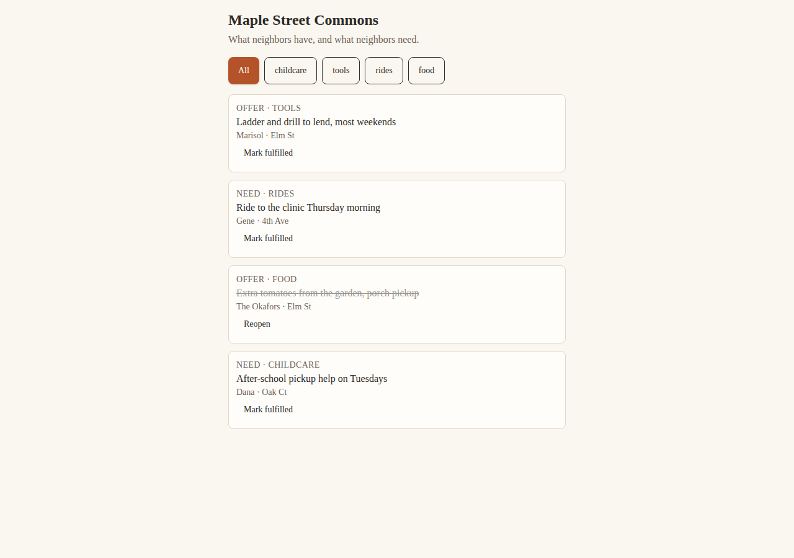

### edit-copy — sonnet-5 (trial 3)

### edit-feature — sonnet-5 (trial 1)

### edit-feature — sonnet-5 (trial 2)

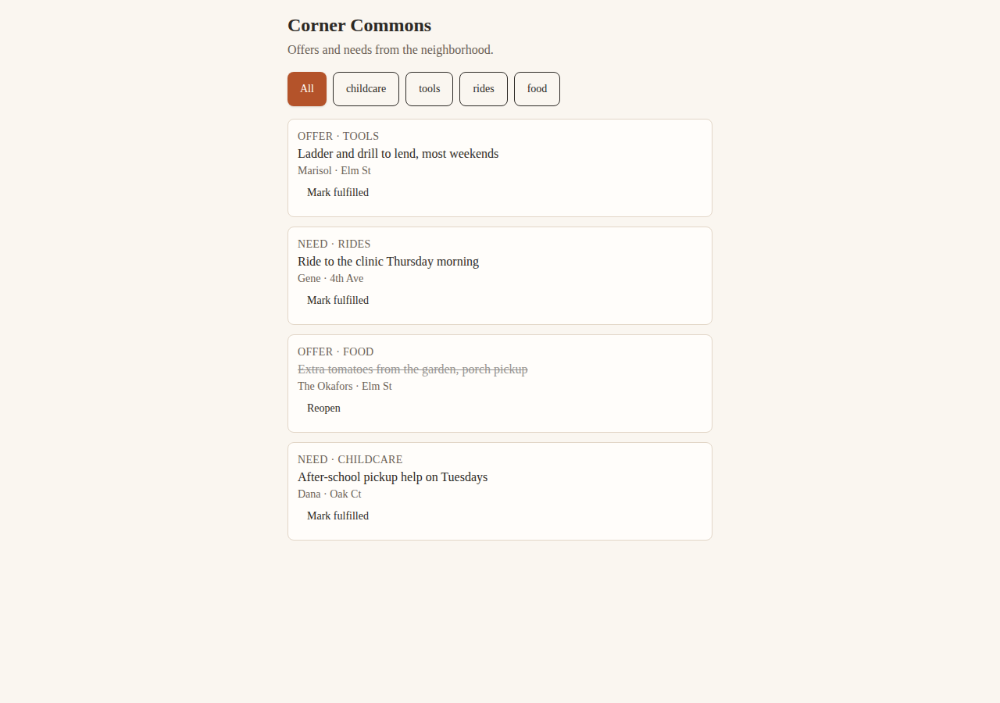

### edit-feature — sonnet-5 (trial 3)

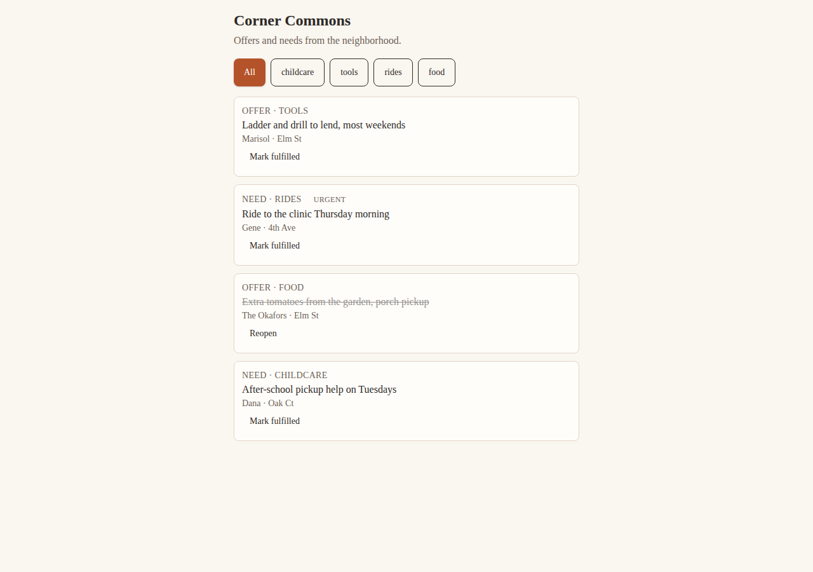

### edit-restyle — sonnet-5 (trial 1)

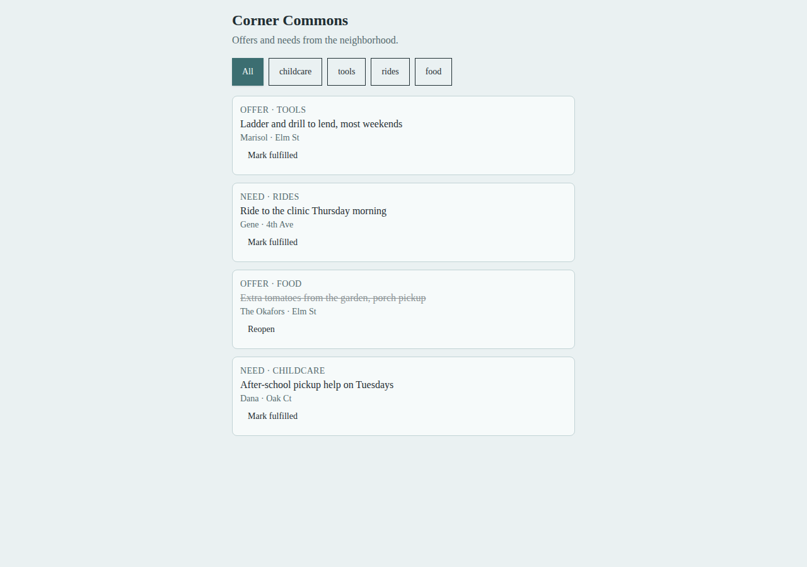

### edit-restyle — sonnet-5 (trial 2)

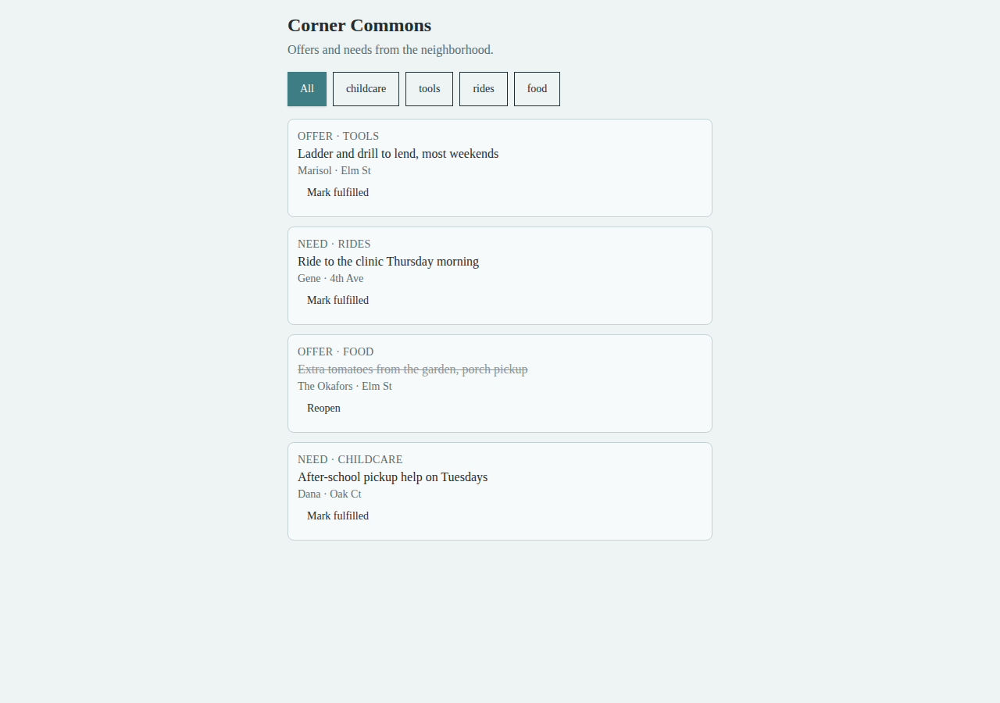

### edit-restyle — sonnet-5 (trial 3)

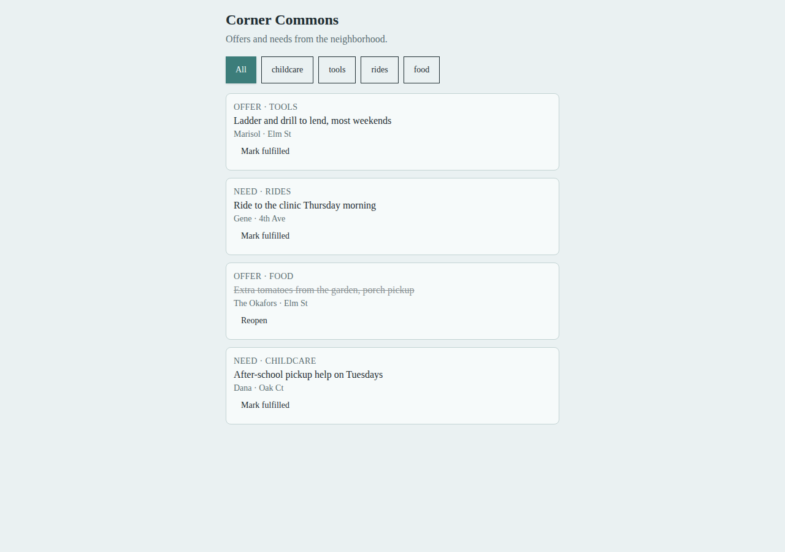
