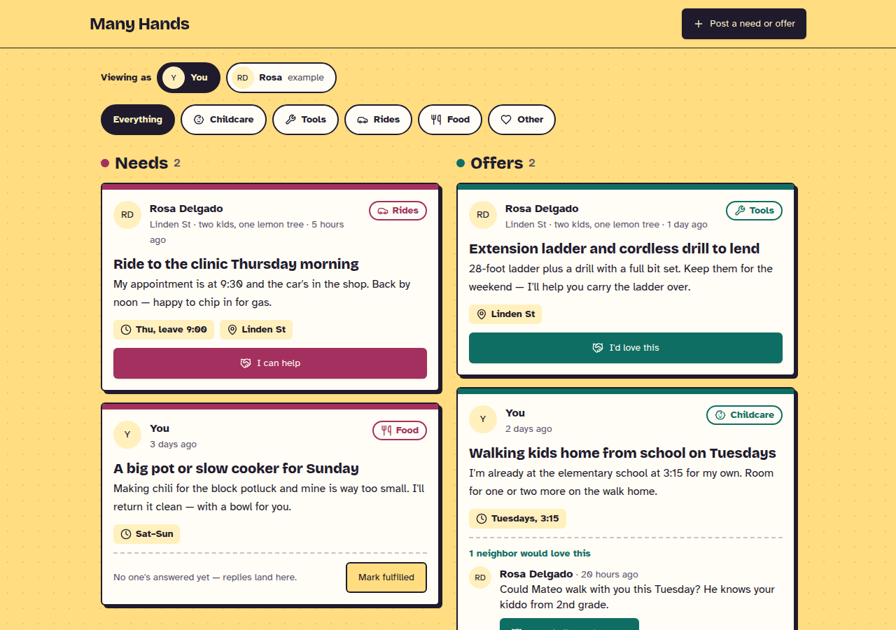
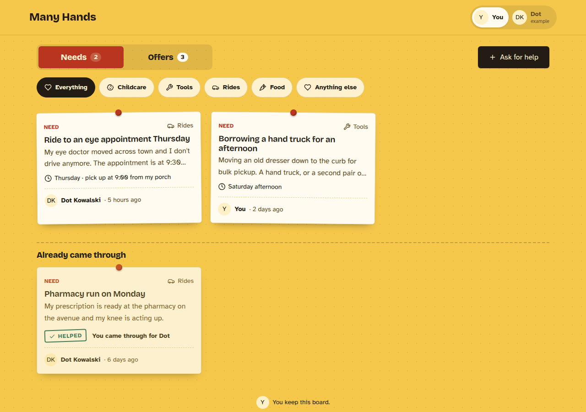
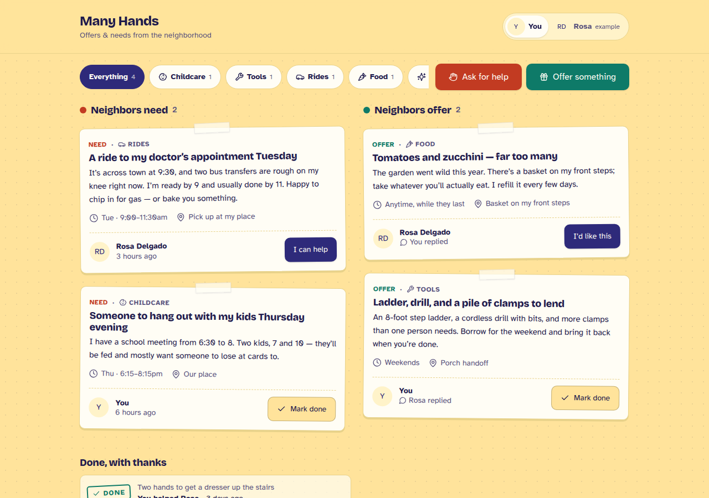
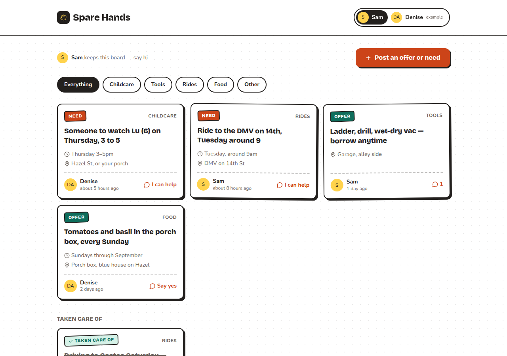
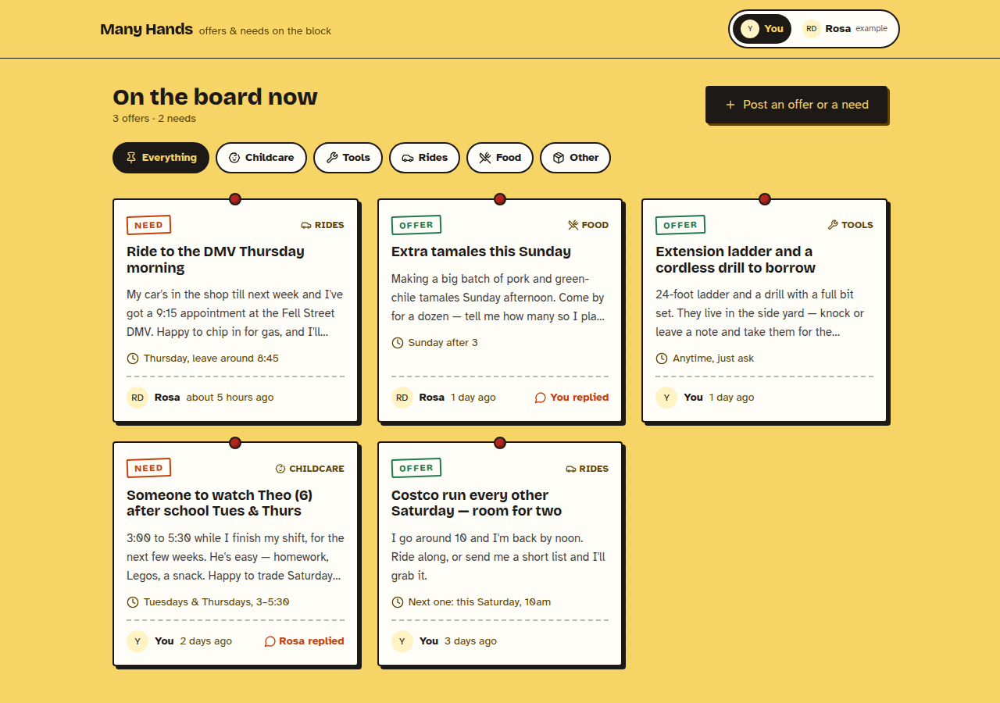
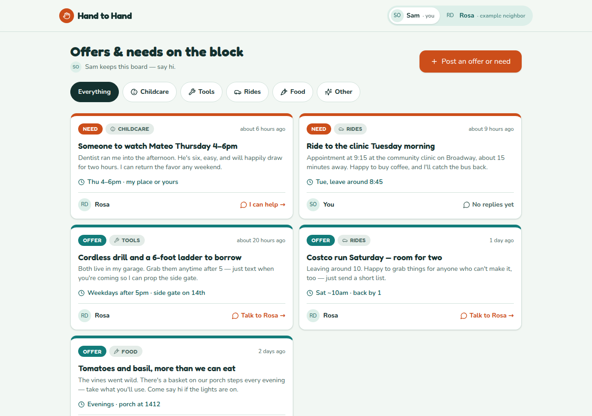

# Model bench — 2026-09-23T15-34-ef1d7eb

- **Tasks:** mutual-aid-board (harness 1.2.0, commit `ef1d7eb`)
- **Date:** 2026-09-23T16:25:08.003Z
- **Trials per model per task:** 3
- **Human review:** _pending_

> Cost and token figures are **estimates** (chars ÷ 4 × list prices) — directional, not billing-grade.
> Mechanical columns are medians across trials. Total = plan + build wall time.
> **Bundle** = final compile success; **First try** = compiled without the auto-fix; **Fix** = of the builds that first failed, how many the single auto-fix pass solved. **~$** includes the fix pass when one ran.

### Task: mutual-aid-board (v1)

| Model | Bundle | First try | Fix | Files | Failed edits | Truncated | Checks | Sec flags | TTFT | Build time | Total | ~$ | |
|---|---|---|---|---|---|---|---|---|---|---|---|---|---|
| claude-opus-5-5 | 3/3 ✓ | 3/3 | — | 10 | 0 | no | 5/5 | 0 | 243s | 507s | 507s | 0.32 |
| claude-fable-5-1 | 3/3 ✓ | 3/3 | — | 9 | 0 | no | 5/5 | 0 | 282s | 507s | 507s | 0.74 |

## Human review

_Not scored yet — open review/index.html, score, export, save as review/scores.json, re-run report._

## Which model for what

_Maintainer's call, informed by the tables above — the report feeds the decision, it doesn't make it._

## Previews

### mutual-aid-board — claude-opus-5-5 (trial 1)

### mutual-aid-board — claude-opus-5-5 (trial 2)

### mutual-aid-board — claude-opus-5-5 (trial 3)

### mutual-aid-board — claude-fable-5-1 (trial 1)

### mutual-aid-board — claude-fable-5-1 (trial 2)

### mutual-aid-board — claude-fable-5-1 (trial 3)

